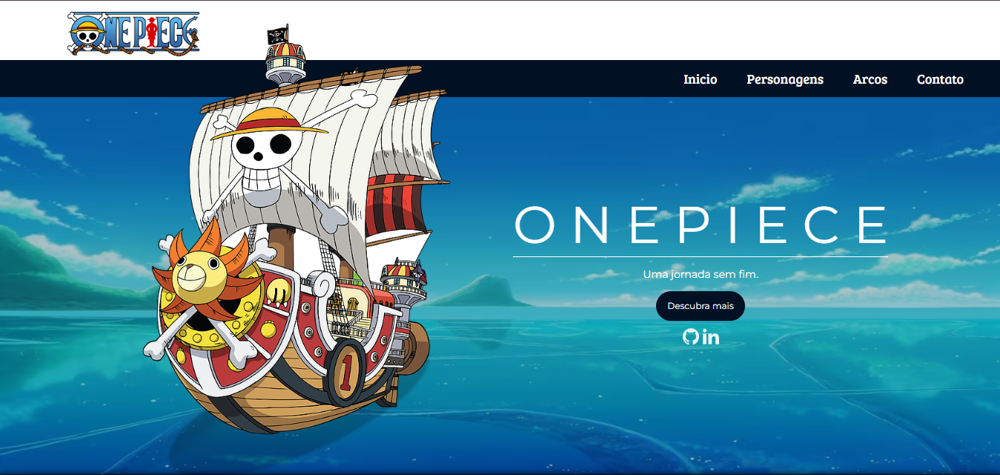
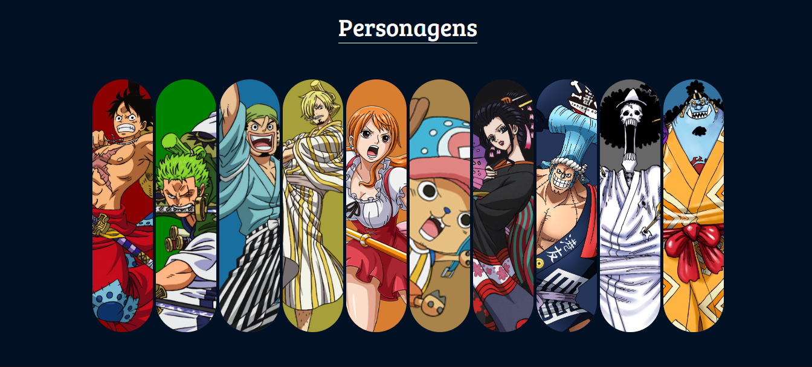
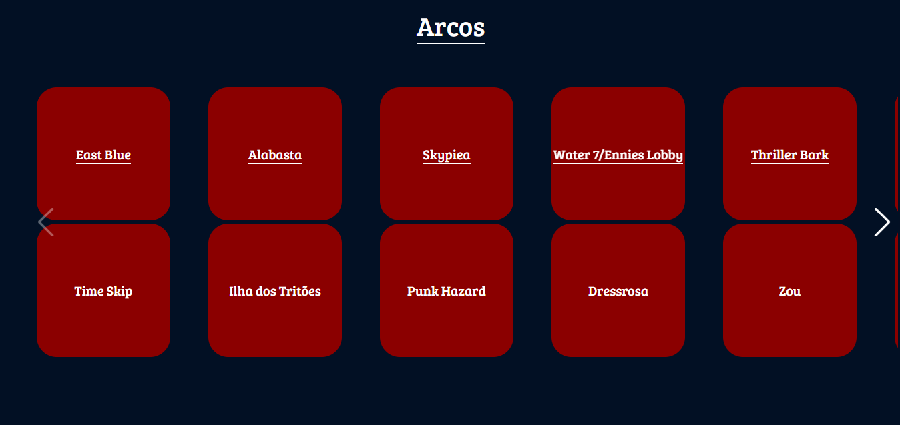
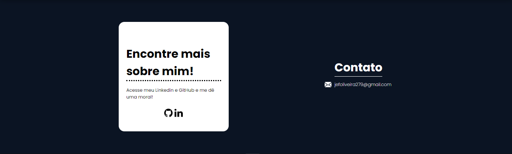

# 💀👒| One Piece Site

 <p> Uma página de um site dedicado ao anime de One Piece, o qual possui informações de personagens e arcos do anime. </b></p>

## Indice
- [Funcionaldiade do projeto](#Funcionalidade-do-projeto)
- [UI](#UI)
- [Executar projeto](#Como-rodar)
- [Tecnologias utilizadas](#Tecnologias-utilizadas)
- [Autor](#Autor)
- [Atualizações Futuras](#Atualizações-futuras)

## Funcionalidade do projeto

- [x] Mostrar informações de personagens do anime;
- [x] Detalhes sobre os arcos do anime.
- [x] Site Responsivo.

## UI
<div align = "center">
    <h3> Página principal </h3>
    
    <h3> Página de Personagens </h3>
    
    <h3> Página de arcos </h3>
    
    <h3> Página de contato </h3>
    
</div>
<br>

## Como rodar o projeto

```bash
# Clone este repositório
$ git clone https://github.com/jefolidev/OnePiece_Site.git

# Acesse a pasta do proejeto no terminal
# cd convertor-temp

# Instale todas dependências
$ npm insall

# Execute a aplicação
```

## Tecnologias utilizadas 
<div align = center>

</div>

## Autor
<div align = center>
 
 <p> <b> Jeferson Franco, Desenvolvedor Full Stack </b> </p> 
 <a style = "text-decoration: none;" href = "https://github.com/jefolidev">  </a>
 <a style = "text-decoration: none;" href = "https://www.linkedin.com/in/jeferson-franco-1349062b0/">  </a>
</div>


## Atualizações futuras
- Atualizar as imagens de personagens quando estiver em telas menores;
- Adicionar um bottão que role para o topo da página;
- Adicionar mais informações sobre os personagens e arcos;
- Fazer um "Hamburguer".
